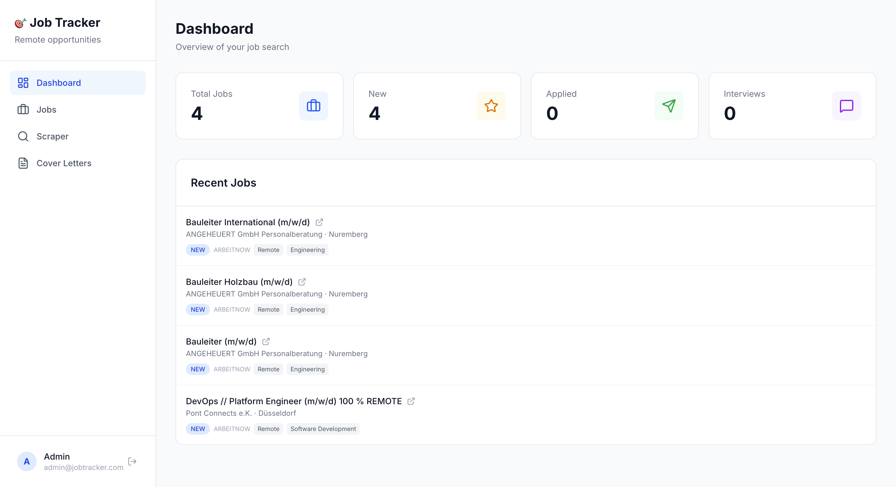
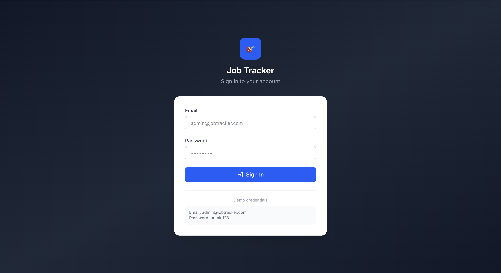
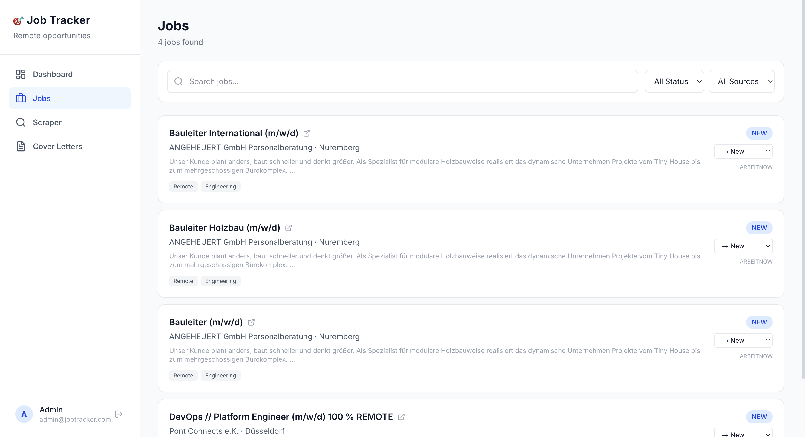
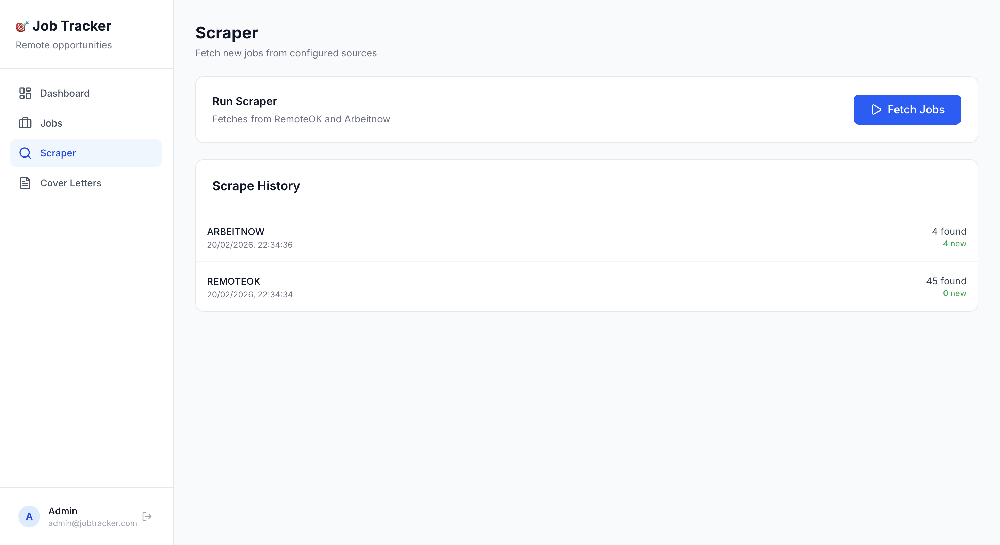
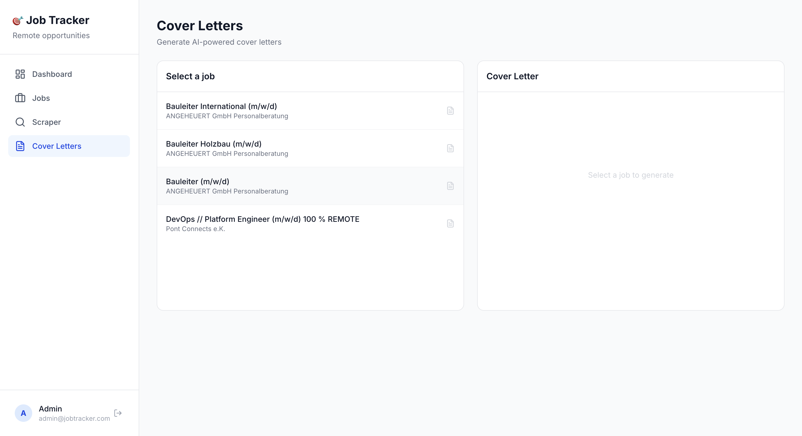

# 🎯 Remote Job Tracker

A full-stack job aggregation platform that scrapes remote developer positions from multiple sources, manages your application pipeline, and generates AI-powered cover letters — turning job hunting into a streamlined workflow.



## Why I Built This

As a developer exploring international remote opportunities, I was spending hours daily checking multiple job boards, copy-pasting job details, and writing cover letters from scratch. This tool automates the entire process: it aggregates jobs from multiple sources, lets me track every application through a visual pipeline, and uses AI to generate personalized cover letters in seconds.

## Features

- **Secure Authentication** — JWT-based login with httpOnly cookies, protected routes, and session management
- **Multi-Source Scraping** — Automatically aggregates remote dev jobs from RemoteOK and Arbeitnow via public APIs
- **Application Pipeline** — Track each job through stages: New → Saved → Applied → Interview → Offer/Rejected
- **Smart Filtering** — Search by title, company, or tags with real-time results. Filter by status and source
- **AI Cover Letters** — Generate personalized cover letters for any job with one click using GPT-4o-mini
- **Scraping Dashboard** — Run scrapers on-demand with full execution history and error tracking
- **Fully Responsive** — Card-based layouts optimized for desktop, tablet, and mobile

## Tech Stack

| Layer | Technology |
|-------|-----------|
| **Framework** | Next.js 15 (App Router) + TypeScript |
| **Database** | PostgreSQL + Prisma ORM |
| **Auth** | JWT (jose) + bcrypt password hashing + httpOnly cookies |
| **Scraping** | Axios + public job board APIs (RemoteOK, Arbeitnow) |
| **AI** | OpenAI API (GPT-4o-mini) for cover letter generation |
| **Styling** | Tailwind CSS v4 |
| **Infrastructure** | Docker, Vercel, Neon |

## Screenshots

| Login | Dashboard |
|-------|-----------|
|  |  |

| Jobs | Scraper |
|------|---------|
|  |  |

| Cover Letters | Mobile |
|---------------|--------|
|  |  |

## Architecture

```
src/
├── app/
│   ├── api/
│   │   ├── auth/
│   │   │   ├── login/        # JWT authentication
│   │   │   ├── me/           # Session verification
│   │   │   └── logout/       # Session termination
│   │   ├── jobs/             # CRUD + filtering
│   │   ├── jobs/[id]/        # Status updates
│   │   ├── scrape/           # Trigger scraping
│   │   ├── stats/            # Dashboard statistics
│   │   └── cover-letter/     # AI generation
│   ├── login/                # Login page (standalone layout)
│   ├── jobs/                 # Job listing with filters
│   ├── scraper/              # Scraper control panel
│   ├── cover-letters/        # AI cover letter generation
│   └── page.tsx              # Main dashboard
├── components/
│   ├── auth-provider.tsx     # Authentication context
│   ├── app-shell.tsx         # Auth-aware layout wrapper
│   ├── sidebar.tsx           # Navigation with logout
│   ├── mobile-header.tsx     # Responsive navigation
│   ├── stats-cards.tsx       # Dashboard KPI cards
│   └── recent-jobs.tsx       # Recent jobs list
└── lib/
    ├── prisma.ts             # Database client singleton
    ├── ai.ts                 # OpenAI integration
    ├── candidate-profile.ts  # Candidate data for cover letters
    └── scrapers/
        ├── types.ts          # Shared interfaces
        ├── remoteok.ts       # RemoteOK API scraper
        ├── arbeitnow.ts      # Arbeitnow API scraper
        └── index.ts          # Scraper orchestrator
```

## Getting Started

### Prerequisites
- Node.js 18+
- Docker
- Git
- OpenAI API key (optional — for cover letter generation)

### Setup

1. Clone and install:
```bash
git clone https://github.com/yamatadev/job-tracker.git
cd job-tracker
npm install
```

2. Start the database:
```bash
docker compose up -d
```

3. Configure environment:
```bash
cp .env.example .env
# Edit .env with your DATABASE_URL and optionally OPENAI_API_KEY
```

4. Run migrations and seed:
```bash
npx prisma migrate dev
npx prisma db seed
```

5. Fetch initial jobs:
```bash
npm run scrape
```

6. Start the dev server:
```bash
npm run dev
```

Open http://localhost:3000

**Login:** admin@jobtracker.com / admin123

## Technical Decisions

- **Next.js App Router** over Pages Router for server components and streamlined API routes
- **JWT with httpOnly cookies** over NextAuth for lightweight auth without third-party dependencies
- **Prisma ORM** for type-safe database operations and seamless migration management
- **Public APIs over web scraping** for reliability — RemoteOK and Arbeitnow both offer free JSON APIs, avoiding anti-bot issues
- **Upsert pattern** to prevent duplicate jobs when re-scraping the same sources
- **Card-based layouts** over tables for mobile responsiveness without horizontal scrolling
- **Modular scraper architecture** — each source is a separate module with a shared interface, making it trivial to add new job boards
- **Cover letter generation** uses the candidate profile as context, ensuring every letter is personalized to both the role and the applicant

## Adding New Job Sources

The scraper system is designed for easy extension:

1. Create a new file in `src/lib/scrapers/` (e.g., `newboard.ts`)
2. Implement the `ScrapedJob[]` return type
3. Register it in `src/lib/scrapers/index.ts`
4. Add the source to the `Source` enum in `prisma/schema.prisma`

## License

MIT
